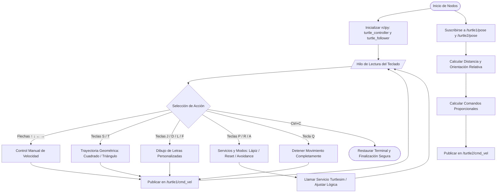

# Laboratorio No. 04: Robótica de Desarrollo, Intro a ROS 2 Jazzy Jalisco - Turtlesim

Este repositorio contiene la solución al Laboratorio No. 04 de la asignatura **Robótica (2026-1)** de la **Universidad Nacional de Colombia**. El objetivo principal es familiarizarse con el ecosistema de **ROS 2 Jazzy Jalisco** sobre **Ubuntu 24.04** utilizando el simulador `turtlesim` y desarrollando nodos de control en Python (`rclpy`).

---

##  Integrantes del Equipo
* **Integrante 1:** Jairo David Diaz Luna - [jdiazlu@unal.edu.co / GitHub]
* **Integrante 2:** Jose Luis Pulido Fonseca - [jpulidof@unal.edu.co / GitHub]

---

##  Descripción General del Laboratorio
El laboratorio tiene como finalidad el aprendizaje y familiarizacion del estudiante con Ubuntu y ROS usando turtlesim mediante la creacion de un script de Python con ejecucion multhilo y la implementacion de nodos se controle una tortuga por medio de comandos de teclado en la terminal. Ademas, se programan trayectorias automaticas tanto predefinidas por el usuario (letras y figuras) como la implementación de un sistema de seguimiento líder-seguidor de dos tortugas usando en ambos control de lazo cerrado.

---
##  Estructura del repositorio

turtlesim_workspace
├── buld
├── install
├── log
└── scr
    └── my_turtle_controller
        ├── my_turtle_controller
        │   ├── __init__.py
        │   ├── move_turtle.py
        │   
        ├── resource
        │   └── my_turtle_controller
        ├── test
        │     
        ├── package.xml
        ├── setup.cfg
        └── setup.py

##  Diagrama de Flujo (Mermaid)
A continuación se presenta la lógica de funcionamiento del programa, abarcando desde la inicialización del nodo hasta su finalización segura:

## Explicación de la Solución Implementada

### 1. Control Manual de la Tortuga
* **Lógica y funciones:** Para capturar el teclado sin bloquear la ejecución paralela y los temporizadores del nodo de ROS 2, se implementó una lectura no bloqueante (usando la configuración de la terminal con los módulos `termios` y `sys` mediante un hilo secundario con `threading`. Al presionar las flechas direccionales (↑, ↓, ←, →), el programa genera un mensaje de tipo `geometry_msgs/msg/Twist`. Las flechas Arriba/Abajo modifican la componente de velocidad lineal (`linear.x`) y las flechas Izquierda/Derecha modifican la velocidad angular (`angular.z`), enviando los datos directamente a través del tópico `/turtle1/cmd_vel`.

### 2. Funciones Automáticas Implementadas
**Lógica del Controlador** : El nodo lee constantemente su posición desde /turtle1/pose. Al solicitar una figura, se calculan las coordenadas absolutas $(x,y)$ a visitar. El controlador ajusta dinámicamente la velocidad lineal proporcional a la distancia y la velocidad angular proporcional al error de orientación, minimizando ambos hasta llegar a una tolerancia (0.03 a 0.15 dependiendo del modo suave/estricto).

**Teclas S, T, L, F (Estricto):** Genera secuencias de waypoints ortogonales o agudos (ej. Cuadrado, Triángulo, letras L y F). El sistema prioriza alinearse (velocidad angular pura) si el error angular es mayor a 0.05 rads antes de avanzar, logrando trazos precisos.
**Teclas J, D (Fluido/Smooth):** Genera curvas calculadas con funciones paramétricas trigonométricas (seno y coseno) interpolando el arco. Permite cierto desplazamiento lineal simultáneo con el giro angular, logrando curvas limpias.
**Tecla R (Reiniciar):** En lugar de usar el servicio /reset nativo que reinicia completamente el simulador, se realiza un reseteo inteligente para no perder a turtle2. Instancia clientes para invocar asíncronamente el servicio /clear (borrando los trazos) y servicios de /turtle1/teleport_absolute y /turtle2/teleport_absolute, regresando a turtle1 a (5.5, 5.5) y a turtle2 a (2.0, 2.0).
**Tecla P (Lápiz):** Alterna el estado del lápiz invocando asíncronamente /turtle1/set_pen, modificando el parámetro off y enviando blanco (255, 255, 255) si dibuja o negro (0, 0, 0) si está inactivo.
**Tecla A (Evasión de límites - Avoidance):** Activa un comportamiento de "caminata aleatoria" cambiando el giro cada cierto tiempo. Si la posición censada supera los márgenes de seguridad ($x, y < 1.5$ o $x, y > 9.5$), el nodo frena ligeramente, calcula el ángulo directo hacia el centro de la pantalla $(5.5, 5.5)$ y aplica un fuerte giro corrector proporcional para forzar el rebote y evitar estrellarse contra los muros.
**Tecla Q (Detener):** Detiene las rutinas automáticas limpiando la lista de waypoints (target_waypoints.clear()) y envía de inmediato un mensaje Twist en cero para frenar en seco.

### 3. Sistema Líder-Seguidor con Dos Tortugas
* **Creación de la segunda tortuga:** Durante la inicialización del nodo, se realiza un llamado directo al servicio `/spawn` para generar a `turtle2` en una posición determinada.
req.x = 2.0
req.y = 2.0
* **Algoritmo de seguimiento:**  El nodo se suscribe simultáneamente a /turtle1/pose y /turtle2/pose. Calcula continuamente el error de posición euclidiana y el error angular:$$e_{distancia} = \sqrt{(x_1 - x_2)^2 + (y_1 - y_2)^2}$$$$\theta_{deseada} = \text{atan2}(y_1 - y_2, x_1 - x_2)$$$$\theta_{error} = \theta_{deseada} - \theta_{actual}$$Constantes Proporcionales ($K_p$): Si la distancia es mayor a 0.3 metros (zona de tolerancia), se envían las siguientes velocidades limitadas (saturación):$V_{lineal} = \min(1.5, 1.2 \times e_{distancia})$$V_{angular} = \max(-2.5, \min(2.5, 3.0 \times \theta_{error}))$
---

## Descripción de Componentes ROS 2
* **Nodos Utilizados:** `turtle_controller` y `turtle_follower` (nodos propios desarrollados en Python ejecutados en un ejecutor multihilo) y `turtlesim_node` (nodo gráfico de simulación suministrado por el sistema).
* **Tópicos Utilizados:** * `/turtle1/cmd_vel` y `/turtle2/cmd_vel`: Mensajes de tipo `geometry_msgs/msg/Twist` para enviar velocidades lineales y angulares a los actuadores.
  * `/turtle1/pose` y `/turtle2/pose`: Mensajes de tipo `turtlesim/msg/Pose` para leer posiciones (x, y) y orientaciones espaciales en tiempo real.
* **Servicios Utilizados:** `/spawn` (creación e instanciación de la segunda tortuga), `/reset` (reinicio global del entorno y limpieza de trazos) y `/turtle1/set_pen` (control del color y rastro de la tortuga principal).

##  Evidencias de Ejecución

* **Movimiento Manual:** 
* **Dibujo de Figuras Geométricas:** 
* **Dibujo de Letras Personalizadas:** 
* **Funcionamiento del Sistema Líder-Seguidor:** 

### Salidas de Comandos de Inspección

1. **ros2 node list**
   * *Explicación de lo observado:* Muestra los nodos en ejecución. Se debe evidenciar la presencia de `los nodos configurados.
/turtlesim
/turtle_controller
/turtle_follower
2. **ros2 topic list**
Explicación de lo observado: Permite verificar la correcta creación de los tópicos de control de velocidad y pose para ambas tortugas

/parameter_events
/rosout
/turtle1/cmd_vel
/turtle1/color_sensor
/turtle1/pose
/turtle2/cmd_vel
/turtle2/color_sensor
/turtle2/pose

3. **ros2 topic echo /turtle1/pose**

Explicación de lo observado: Muestra el flujo constante de datos espaciales (x, y, theta) y velocidades de la tortuga líder

x: 5.544444561004639
y: 5.544444561004639
theta: 0.0
linear_velocity: 0.0
angular_velocity: 0.0
---

4. **ros2 topic info /turtle1/cmd_vel**

Explicación de lo observado: Confirma el tipo de mensaje y que existe un publicador asignado.

Type: geometry_msgs/msg/Twist
Publisher count: 1
Subscription count: 1

5. **ros2 service list**
Explicación de lo observado: Enumera las funciones a las que podemos llamar, comprobando la existencia de set_pen, spawn y reset.

/clear
/kill
/reset
/spawn
/turtle1/set_pen
/turtle2/set_pen

6. Visualización de la Arquitectura (rqt_graph)

Explicación de las conexiones: Muestra visualmente la topología de la red de ROS, donde nuestro nodo lee las poses y escribe comandos Twist en ambas tortugas.

Codigo Fuente. 

aca va el codigo xdxdxd

Video Explicativo

El análisis del código fuente, los criterios de diseño técnico seleccionados y la demostración en tiempo real de la simulación se pueden visualizar en el siguiente enlace:

[Enlace al video de la sustentación (Vídeo Máx 10 minutos)]

Conclusiones
Conclusión 1: El desarrollo de este laboratorio bajo ROS 2 Jazzy Jalisco permitió asimilar de forma práctica los conceptos de Middleware y la programación orientada a eventos mediante callbacks empleando rclpy.

Conclusión 2: Diseñar esquemas de control cinemático síncronos (como el sistema líder-seguidor) recalca la importancia de estructurar arquitecturas de software eficientes y de carácter no bloqueante para garantizar la estabilidad de sistemas robóticos en tiempo real.

