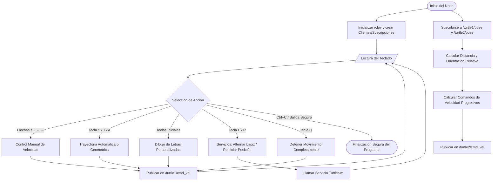

# Laboratorio No. 04: Robótica de Desarrollo, Intro a ROS 2 Jazzy Jalisco - Turtlesim

Este repositorio contiene la solución al Laboratorio No. 04 de la asignatura **Robótica (2026-1)** de la **Universidad Nacional de Colombia**. El objetivo principal es familiarizarse con el ecosistema de **ROS 2 Jazzy Jalisco** sobre **Ubuntu 24.04** utilizando el simulador `turtlesim` y desarrollando nodos de control en Python (`rclpy`).

---

##  Integrantes del Equipo
* **Integrante 1:** Jairo David Diaz Luna - [jdiazlu@unal.edu.co / GitHub]
* **Integrante 2:** Jose Luis Pulido Fonseca - [jpulidof@unal.edu.co / GitHub]

---

##  Descripción General del Laboratorio
El laboratorio tiene como finalidad el aprendizaje y familiarizacion del estudiante con Ubuntu y ROS usando turtlesim, de modo que por medio de la creacion de un script y la implementacion de nodos se controle la tortuga por medio de comandos en la terminal, ademas de programar trayectorias automaticas tanto predefinidas por el usuario como la implementación de un sistema de seguimiento líder-seguidor de dos tortugas.


---

##  Diagrama de Flujo (Mermaid)
A continuación se presenta la lógica de funcionamiento del programa, abarcando desde la inicialización del nodo hasta su finalización segura:


## Explicación de la Solución Implementada

### 1. Control Manual de la Tortuga
* **Lógica y funciones:** Para capturar el teclado sin bloquear la ejecución paralela y los temporizadores del nodo de ROS 2, se implementó una lectura no bloqueante (usando la configuración de la terminal con los módulos `termios` y `sys`, o mediante un hilo secundario con `threading`). Al presionar las flechas direccionales (↑, ↓, ←, →), el programa genera un mensaje de tipo `geometry_msgs/msg/Twist`. Las flechas Arriba/Abajo modifican la componente de velocidad lineal (`linear.x`) y las flechas Izquierda/Derecha modifican la velocidad angular (`angular.z`), enviando los datos directamente a través del tópico `/turtle1/cmd_vel`.

### 2. Funciones Automáticas Implementadas
* **Tecla S (Cuadrado):** Se estructuró un bucle controlado por tiempo. El nodo publica una velocidad lineal en `linear.x` para recorrer un segmento recto, y posteriormente aplica una velocidad angular constante en `angular.z` calculada junto con un temporizador para realizar un giro preciso de 90° ($\pi/2$ radianes). Esta secuencia se ejecuta de forma secuencial 4 veces.
* **Tecla T (Triángulo Equilátero):** Sigue la misma lógica temporal que el cuadrado, pero ajustando la rotación en `angular.z` para completar giros externos de 120° ($2\pi/3$ radianes) repetidos en 3 ocasiones.
* **Tecla R (Reiniciar):** Instancia un cliente de ROS 2 para invocar de manera asíncrona el servicio `/reset`. Al pulsar la tecla, el simulador limpia los trazos de la pantalla y reubica la tortuga en su posición inicial central (5.5, 5.5).
* **Tecla P (Lápiz):** Llama de forma asíncrona al servicio `/turtle1/set_pen`. Modifica los parámetros de activación (`off`), permitiendo habilitar o deshabilitar el rastro de la tortuga para desplazarse sin dibujar.
* **Tecla A (Evasión de límites):** El nodo se suscribe activamente al tópico `/turtle1/pose`. Si las coordenadas recibidas se aproximan a los límites críticos de la ventana del simulador (valores de $x$ o $y$ cercanos a 0.5 o 10.5), el algoritmo interrumpe momentáneamente el comando actual y publica velocidades angulares forzadas para hacer girar la tortuga y alejarla del borde.
* **Tecla Q (Detener):** Detiene de forma inmediata cualquier rutina automática o manual enviando un mensaje `Twist` con todos sus componentes en cero absoluto a `/turtle1/cmd_vel`.

### 3. Dibujo de Letras Personalizadas
* **Iniciales del Grupo:** Se configuró la rutina para trazar las letras de las iniciales de los nombres de los integrantes J, D , P y L para Jairo David Diaz Luna y Jose Luis Pulido.
* **Lógica de dibujo:** Se diseñó una pequeña máquina de estados basada en temporizadores de ROS 2. Cada letra se compone de una secuencia ordenada de avances lineales y giros angulares.

### 4. Sistema Líder-Seguidor con Dos Tortugas
* **Creación de la segunda tortuga:** Durante la inicialización del nodo, se realiza un llamado directo al servicio `/spawn` para generar a `turtle2` en una posición alejada de la principal.
* **Algoritmo de seguimiento:** El nodo cuenta con dos suscripciones simultáneas a `/turtle1/pose` y `/turtle2/pose`. En la función callback se calcula el error de posición mediante la distancia euclidiana:
  $$e = \sqrt{(x_1 - x_2)^2 + (y_1 - y_2)^2}$$
  Y la orientación objetivo se define a través de:
  $$\theta_{deseada} = \text{atan2}(y_1 - y_2, x_1 - x_2)$$
  Aplicando un control proporcional simple ($K_p$), se determinan las velocidades lineales y angulares requeridas y se publican continuamente en `/turtle2/cmd_vel` para que la segunda tortuga persiga de manera dinámica a la primera.

---

## Descripción de Componentes ROS 2
* **Nodos Utilizados:** `move_turtle` (nodo propio desarrollado en Python) y `turtlesim_node` (nodo gráfico de simulación suministrado por el sistema).
* **Tópicos Utilizados:** * `/turtle1/cmd_vel` y `/turtle2/cmd_vel`: Mensajes de tipo `geometry_msgs/msg/Twist` para enviar velocidades.
  * `/turtle1/pose` y `/turtle2/pose`: Mensajes de tipo `turtlesim/msg/Pose` para leer posiciones y orientaciones.
* **Servicios Utilizados:** `/spawn` (creación de entidades), `/reset` (reinicio del entorno) y `/turtle1/set_pen` / `/turtle2/set_pen` (control del lápiz).

---

## 📺 Evidencias de Ejecución

>  *Reemplaza los textos `ruta/a/la/imagen.png` por la ubicación real de tus capturas dentro de la estructura de carpetas del repositorio.*

### Pruebas de Funcionamiento en la Simulación
* **Movimiento Manual:** 
* **Dibujo de Figuras Geométricas:** 
* **Dibujo de Letras Personalizadas:** 
* **Funcionamiento del Sistema Líder-Seguidor:** 

### Salidas de Comandos de Inspección

1. **`ros2 node list`**
   * *Explicación de lo observado:* Muestra los nodos en ejecución. Se debe evidenciar la presencia de `/turtlesim` y el nodo personalizado `/move_turtle`.
   ```bash
   /turtlesim
   /move_turtle

Explicación de lo observado: Permite verificar la correcta creación de los tópicos de control de velocidad y pose para ambas tortugas

/parameter_events
/rosout
/turtle1/cmd_vel
/turtle1/color_sensor
/turtle1/pose
/turtle2/cmd_vel
/turtle2/color_sensor
/turtle2/pose

2. ros2 topic echo /turtle1/pose

Explicación de lo observado: Muestra el flujo constante de datos espaciales (x, y, theta) y velocidades de la tortuga líder


x: 5.544444561004639
y: 5.544444561004639
theta: 0.0
linear_velocity: 0.0
angular_velocity: 0.0
---

3. ros2 topic info /turtle1/cmd_vel

Explicación de lo observado: Confirma el tipo de mensaje y que existe un publicador asignado.
Type: geometry_msgs/msg/Twist
Publisher count: 1
Subscription count: 1

4. ros2 service list
Explicación de lo observado: Enumera las funciones a las que podemos llamar, comprobando la existencia de set_pen, spawn y reset.

Bash


/clear
/kill
/reset
/spawn
/turtle1/set_pen
/turtle2/set_pen


5. Visualización de la Arquitectura (rqt_graph)

Explicación de las conexiones: Muestra visualmente la topología de la red de ROS, donde nuestro nodo lee las poses y escribe comandos Twist en ambas tortugas.

Codigo Fuente. 

Video Explicativo
El análisis del código fuente, los criterios de diseño técnico seleccionados y la demostración en tiempo real de la simulación se pueden visualizar en el siguiente enlace:

[Enlace al video de la sustentación (Vídeo Máx 10 minutos)]

Conclusiones
Conclusión 1: El desarrollo de este laboratorio bajo ROS 2 Jazzy Jalisco permitió asimilar de forma práctica los conceptos de Middleware y la programación orientada a eventos mediante callbacks empleando rclpy.

Conclusión 2: Diseñar esquemas de control cinemático síncronos (como el sistema líder-seguidor) recalca la importancia de estructurar arquitecturas de software eficientes y de carácter no bloqueante para garantizar la estabilidad de sistemas robóticos en tiempo real.


